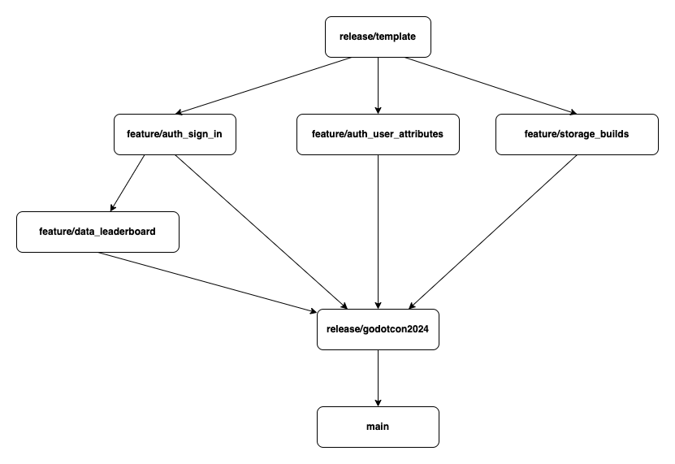

## AWS Amplify for Godot Engine - Sample

This project contains an AWS Amplify project sample to create, build, export and deploy Godot Engine projects on AWS.

It uses a sample game named [Squash The Creeps](https://github.com/godotengine/godot-demo-projects/tree/master/3d/squash_the_creeps) from the [Godot Demo Projects](https://github.com/godotengine/godot-demo-projects). You can learn how to build this game from scratch in the [Godot Documentation](https://docs.godotengine.org) in the [Your first 3D game](https://docs.godotengine.org/en/stable/getting_started/first_3d_game/index.html) section.

_Note: “The sample code; software libraries; command line tools; proofs of concept; templates; or other related technology (including any of the foregoing that are provided by our personnel) is provided to you as AWS Content under the AWS Customer Agreement, or the relevant written agreement between you and AWS (whichever applies). You should not use this AWS Content in your production accounts, or on production or other critical data. You are responsible for testing, securing, and optimizing the AWS Content, such as sample code, as appropriate for production grade use based on your specific quality control practices and standards. Deploying AWS Content may incur AWS charges for creating or using AWS chargeable resources, such as running Amazon EC2 instances or using Amazon S3 storage.”_

## Quickstart

If you need step by step tutorials you can use our [quicktstarts](https://github.com/aws-samples/amplify-godot-engine/wiki/Create-a-New-Game) or explore [labs](https://github.com/aws-samples/amplify-godot-engine/wiki) on the wiki.

## Organization

This reposotory contains several samples organized in git branches.

Each branch contains a 'byte size' deployable sample to showcase a specific feature offered by AWS Amplify or AWS CDK extensions.

Here is the list of current samples:
- `feature/auth_sign_in`: Player sign-up, sign-in and sign-out workflows with the AuthForm.
- `feature/auth_user_attributes`: Player preferred name and avatar color updates leveraging user attributes.
- `feature/data_leaderboard`: Player score storage iwith AWS Amplify data capabilities and leaderboard display.
- `feature/storage_builds`: Game builds storage on Amazon S3 for different platforms such as Linuw, Windsow and macOS. 

Here is the list of advanced samples:
- `release/template`: A clone of the [`amplify-godot-engine-template`](https://github.com/aws-samples/amplify-godot-engine-template)
- `release/godotcon2024`: This branch contains all features showcased at GodotCon 2024
- `main`: This branch is currently in sync with `release/godotcon2024`

## Wiki

The [wiki](https://github.com/aws-samples/amplify-godot-engine/wiki) contains everything you want to know about getting started with AWS Amplify with the Godot Engine.

## Discussions

If you have a question or you want to discuss with the AWS Amplify for Godot Engine community go to the main project [discussions](https://github.com/aws-samples/amplify-godot-engine/discussions) channels.

## Issues

If you have any issue with a custom build image [report a bug](https://github.com/aws-samples/amplify-godot-engine-template/issues/new?assignees=&labels=&projects=&template=bug_report.md&title=) and if you need a new image or something else  [create a feature request](https://github.com/aws-samples/amplify-godot-engine-template/issues/new?assignees=&labels=&projects=&template=feature_request.md&title=).

## Security

See [CONTRIBUTING](CONTRIBUTING.md#security-issue-notifications) for more information.

## License

This library is licensed under the MIT-0 License. See the [LICENSE](LICENSE.md) file.

## Third Party Licenses

See [THIRD_PARTY_LICENSES](THIRD_PARTY_LICENSES.md) for more information.

